# Data Preprocessing & Feature Engineering

Data Preprocessing is done between when we have raw data and model training phase

 

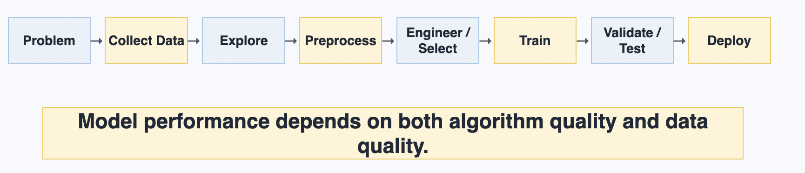

 

## Why

- Poor data representation can hide useful patterns.
- Good preprocessing makes the data easier for algorithms to learn from.
- Preprocessing decisions must be repeatable and well documented.

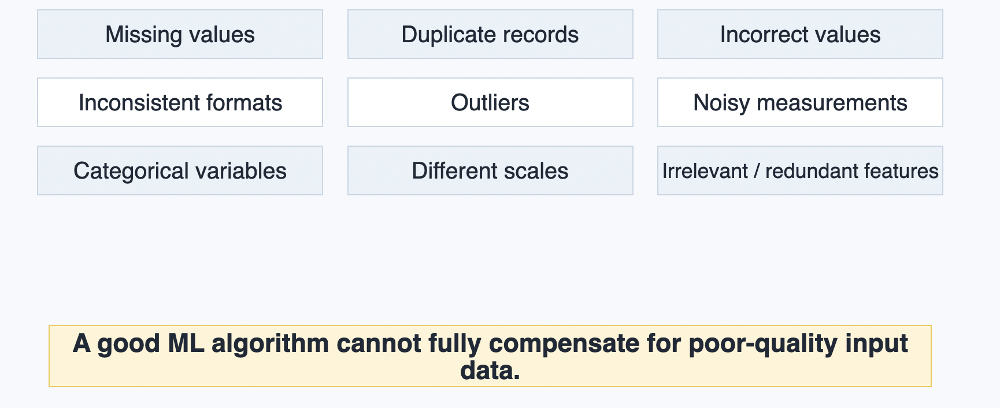

 

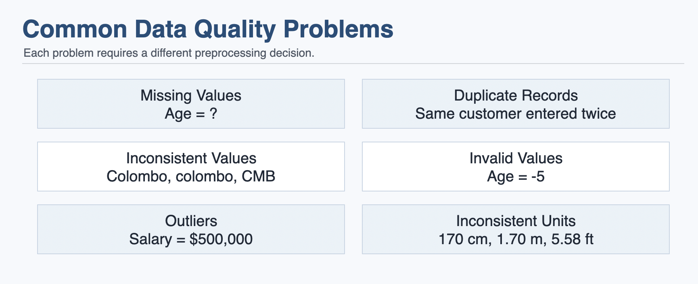

 

## Data Cleaning Workflow

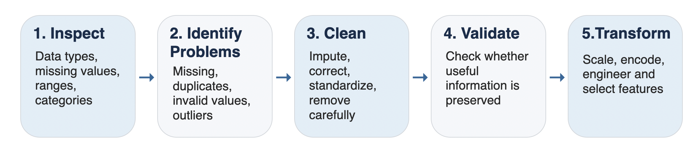

 

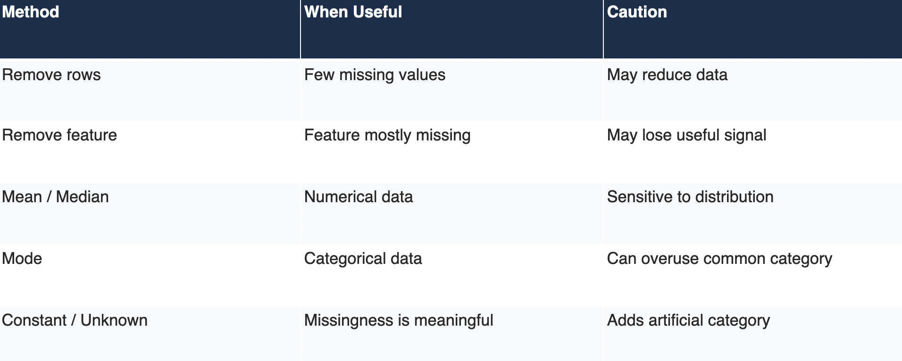

 

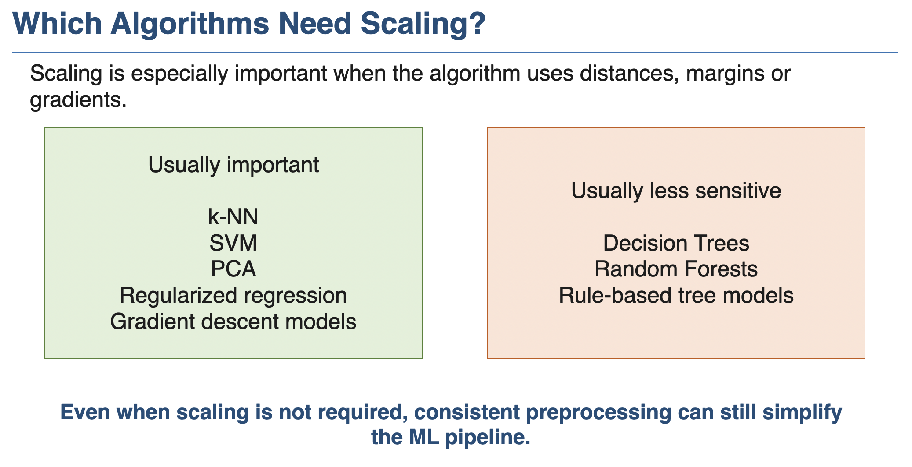

---

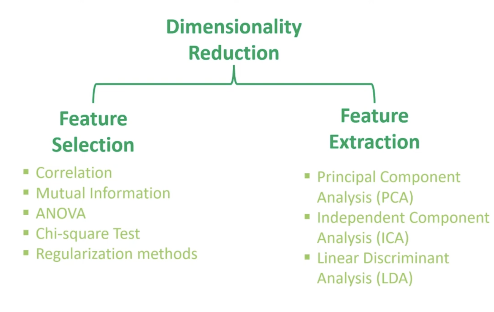

In `Features Selection` we select most wanted features only

In `Features Extraction` we combined some columns and create new columns as we want

---

## One Hot Encoding

Suppose, we have below data set.
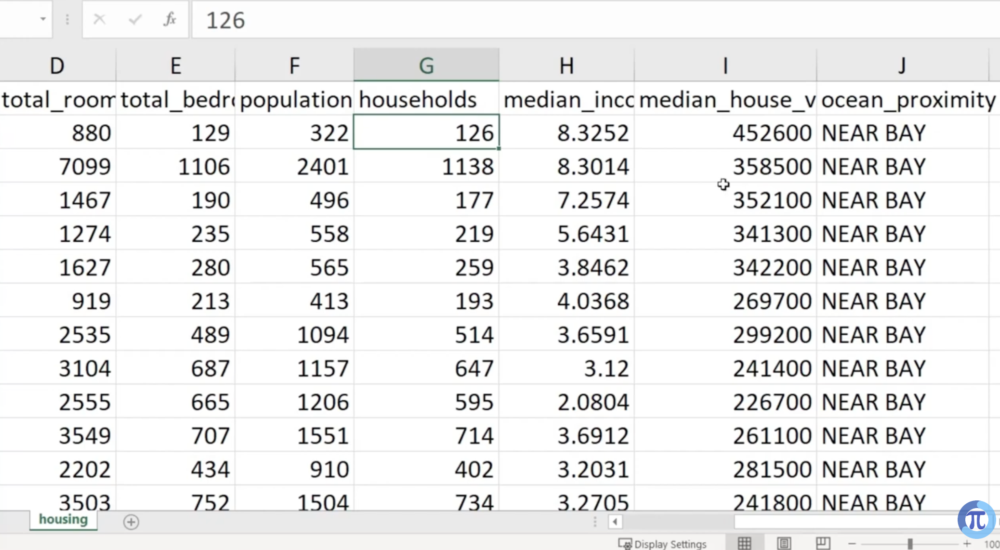
In here, proximity column can't read for models so we need to convert that into numerical number.

But if we change like this, our models doesnt see them as different classes. They seem those as values compaired to other values. (If 0 is the value, it compaires between 1 and 2). This is an issue.
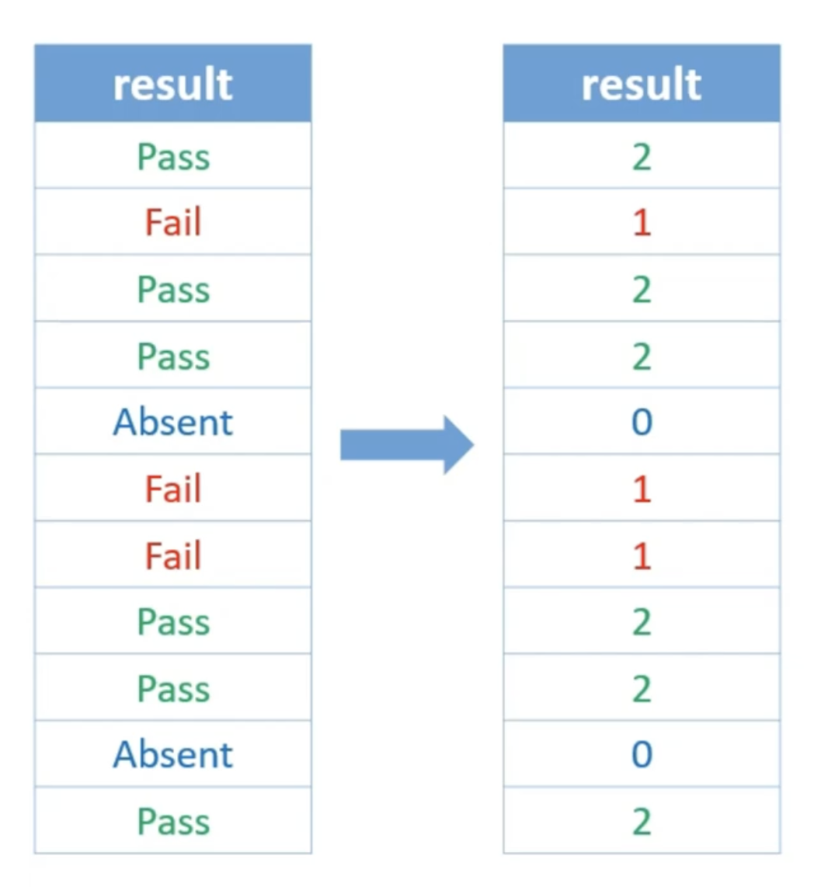

For that one we use `One Hot Encoding Method`
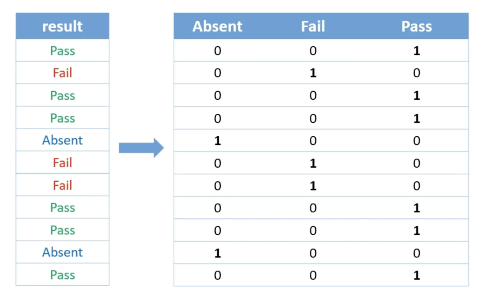

So, `this is a data pre-processing step that turns text or category names into numbers. It makes a new column for each unique choice. It puts a 1 to show the right choice and 0 for all other choices`

## Examples

Look these examples about how we doing the feature enginneering when we have a superived / unsupervised problem

[Supervised Example](../../python/feature-selectioins/feature_selection_supervised_learning.ipynb)
[Unsupervised Example](../../python/feature-selectioins/feature_selection_unsupervised_learning.ipynb)

---

## Outlier Detection

If our data set has unusual abnormal data, we can identify those things as `Outliers`

We can remove those things as well

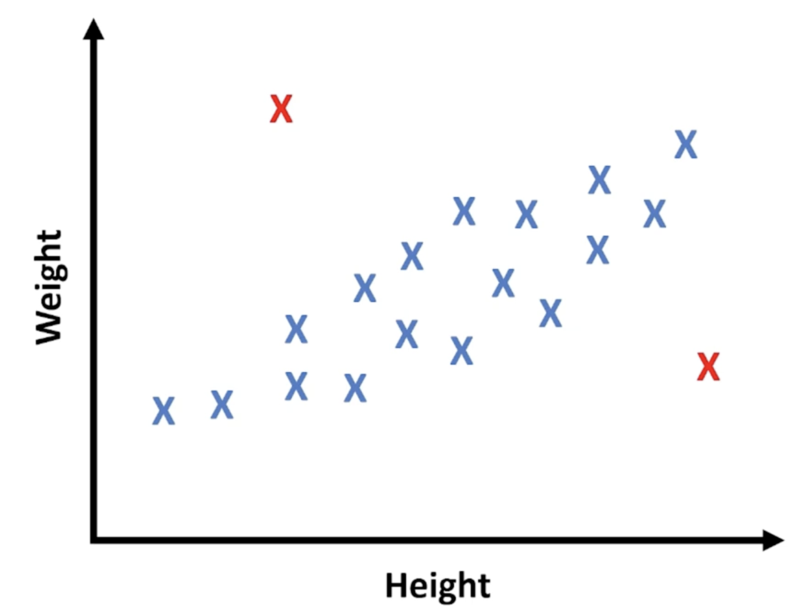

 

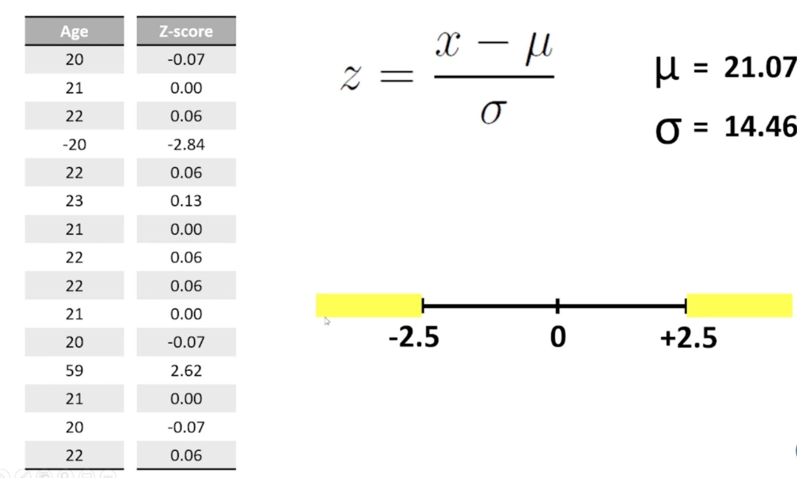
