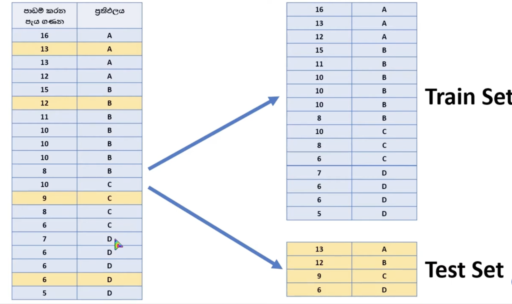
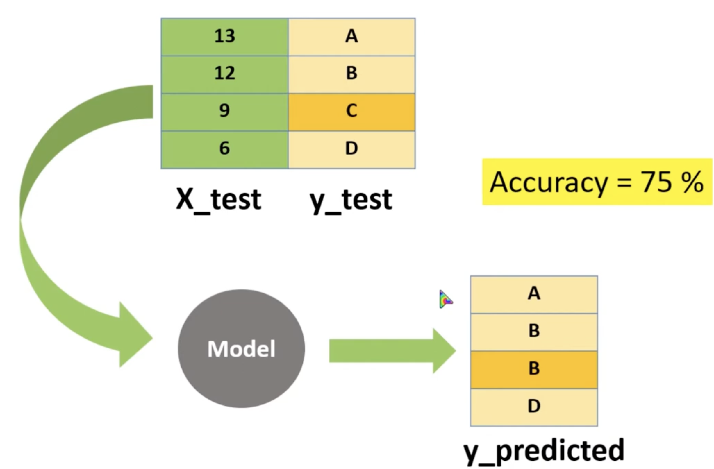

# Train - Test Data Split

We split data into training and test sets to `evaluate how well a machine learning model generalizes to new, unseen data`




<br/>

## The Three-Way Split (The Best Practice)

```pwd
┌──────────────────────────────────────────────────────────┐
│                       Total Dataset                      │
└────────────────────────────┬─────────────────────────────┘
                             │
       ┌─────────────────────┼─────────────────────┐
       ▼                     ▼                     ▼
┌──────────────┐      ┌──────────────┐      ┌──────────────┐
│ Training Set │      │Validation Set│      │   Test Set   │
│  (60% - 80%) │      │  (10% - 20%) │      │  (10% - 20%) │
└──────────────┘      └──────────────┘      └──────────────┘
```

1. **Training Set (60% - 80% of data)**
Used to build and train the model.The algorithm looks at this data to find patterns and adjust its internal weights.

2. **Validation / Dev Set (10% - 20% of data)**
Used to fine-tune the model's settings (hyperparameters).It acts as a "mock exam" to check performance during the development stage.

3. **Test Set (10% - 20% of data)**
Kept completely hidden until the very end of development.Used only once to provide the final grade on the model's ultimate capabilities.

<br/>

## Example

```python
import numpy as np
from sklearn.model_selection import train_test_split

# Define the features (x) and target labels (y)
x = np.array([1, 2, 3, 4, 5, 6, 7, 8, 9, 10, 11, 12, 13, 14, 15, 16, 17, 18, 19, 20])
y = np.array([0, 0, 1, 0, 1, 0, 0, 0, 0, 0, 1, 1, 1, 0, 1, 0, 1, 1, 1, 1])

# Split the data into training and test sets (80% train, 20% test)
x_train, x_test, y_train, y_test = train_test_split(x, y, test_size=0.2)

# Display the training features
print("x_train:", x_train)

# Check the length of training and testing features
print("len(x_train):", len(x_train))
print("len(x_test):", len(x_test))
```
