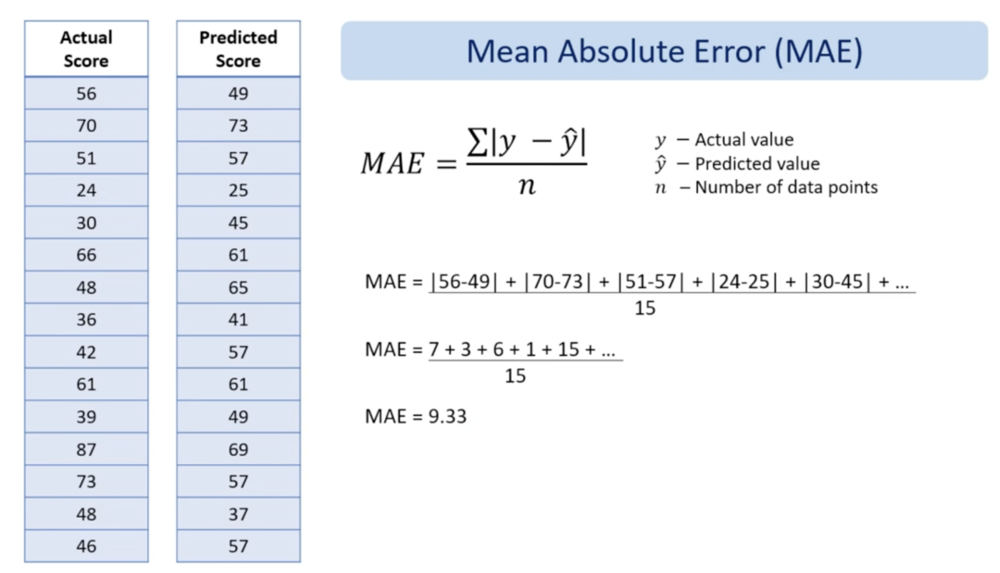
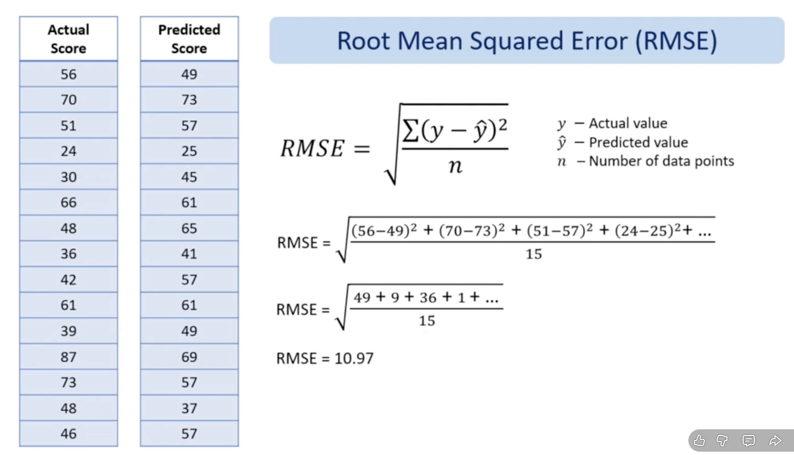
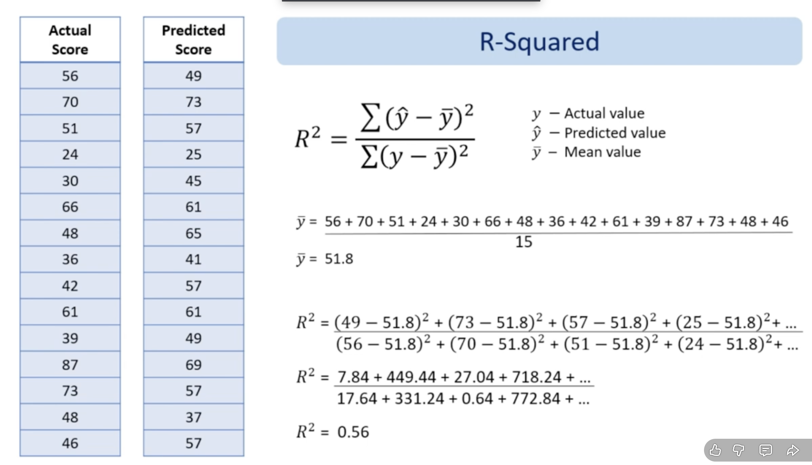

# Evaluate Regression Models

We are using `Regression Metrics`

 

## Mean Absolute Error

Lower values mean better accuracy.

 

## Root Mean Squard Error

Lower values mean better accuracy.

 

## R - Squard Error

Higher values mean better explanatory power.
