# Data

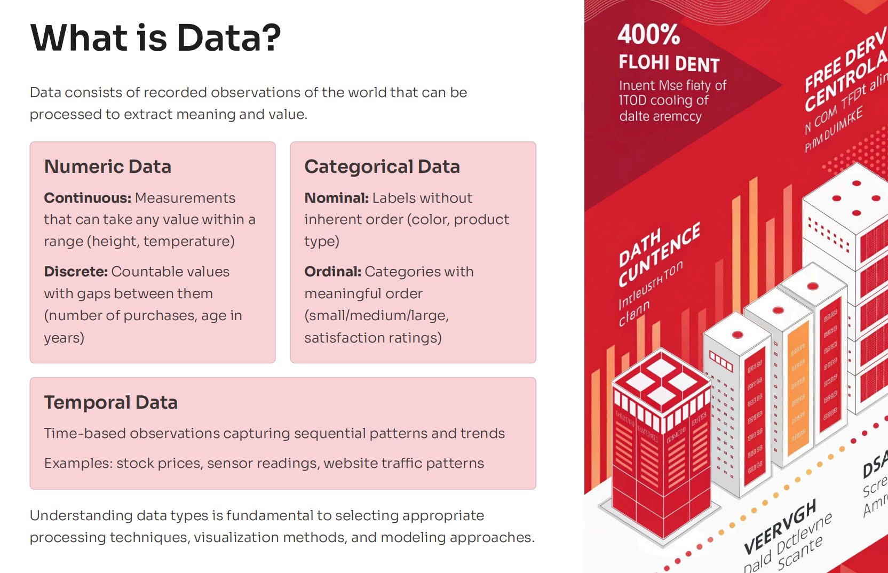

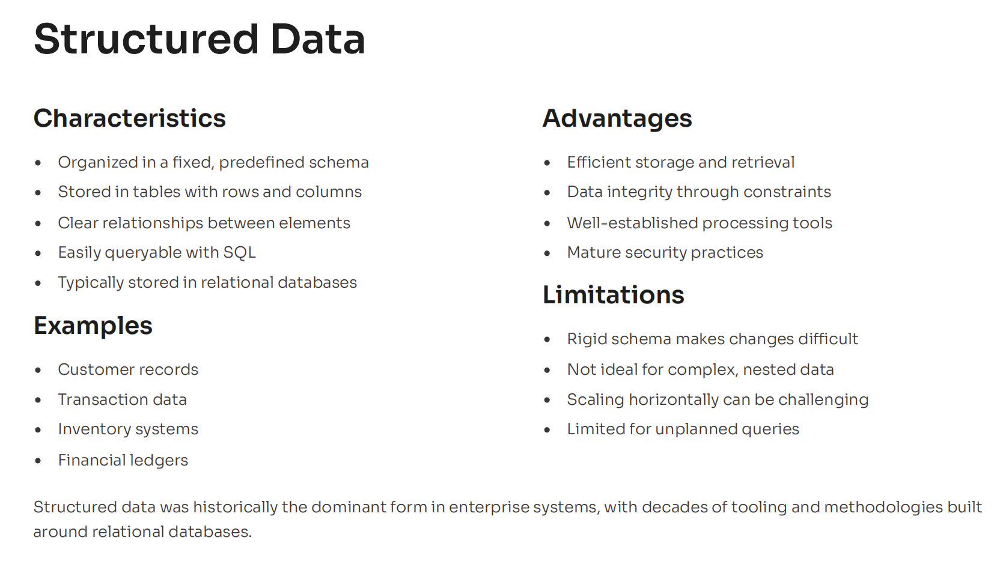

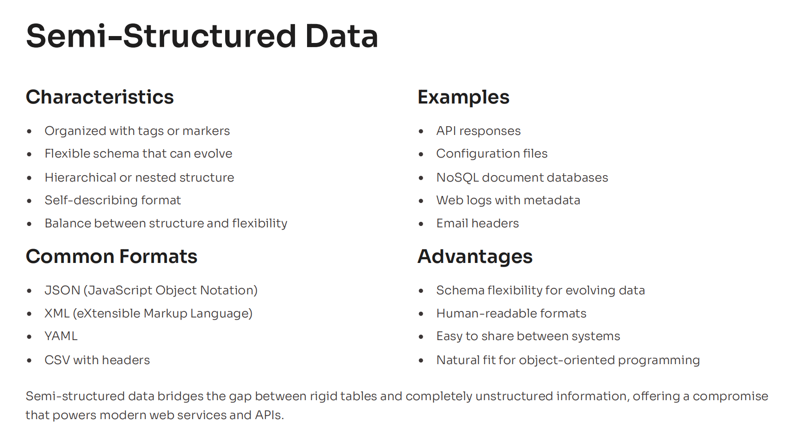

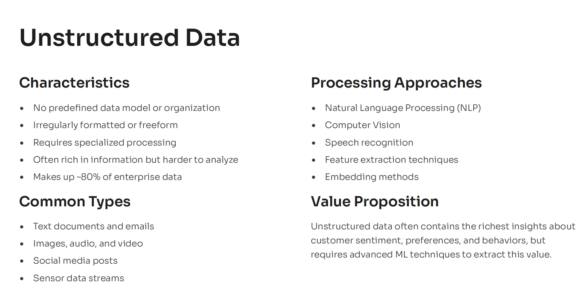

 

---

## 3Vs of Data

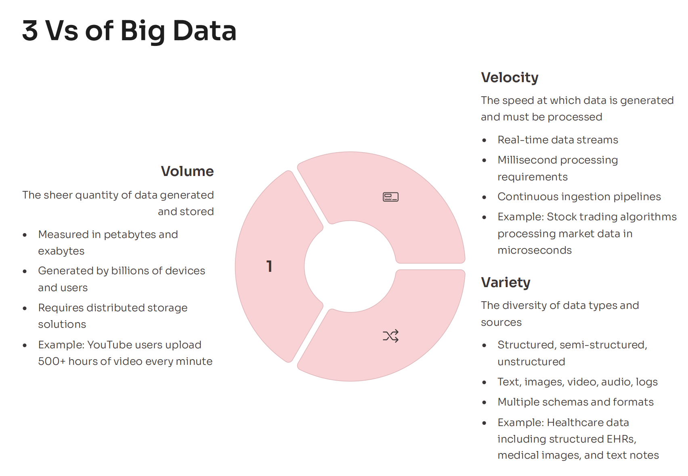

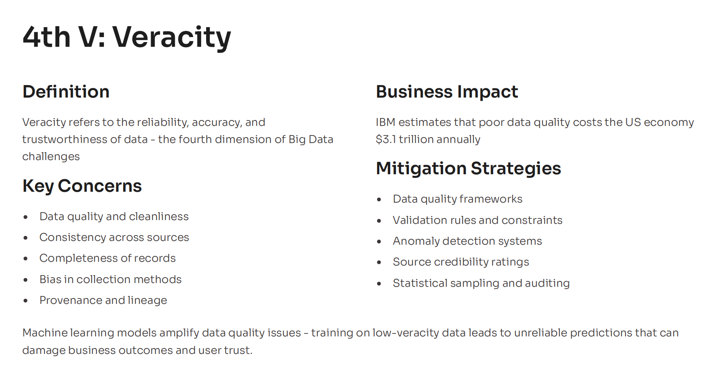

---

## Data Storage

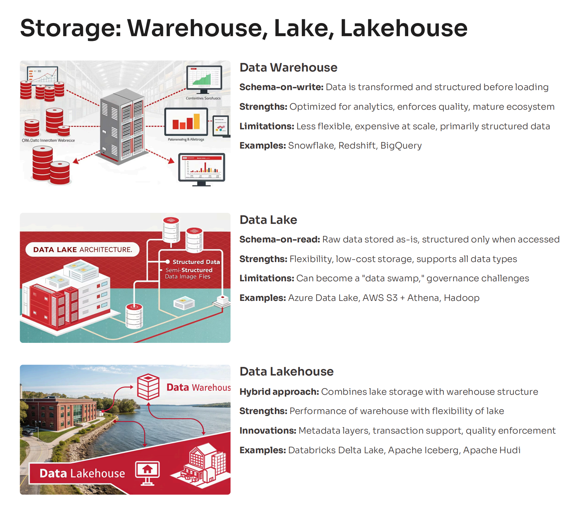

 

---

## GIGO Principle

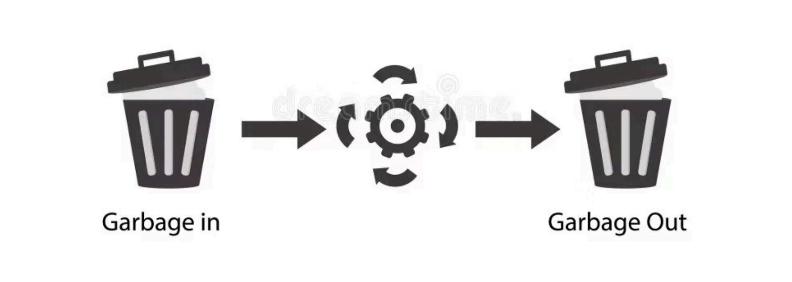
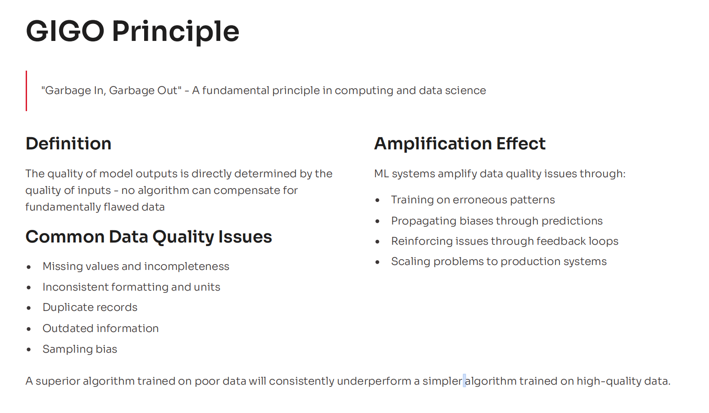
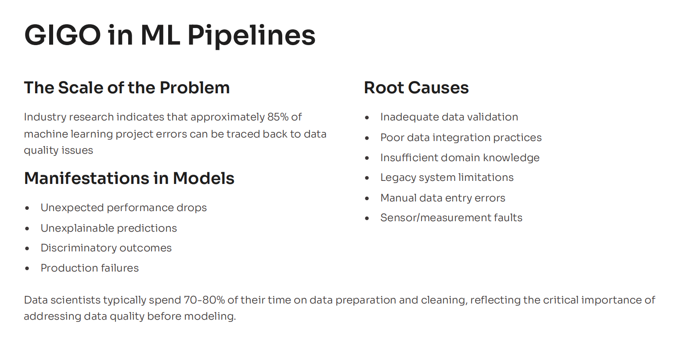
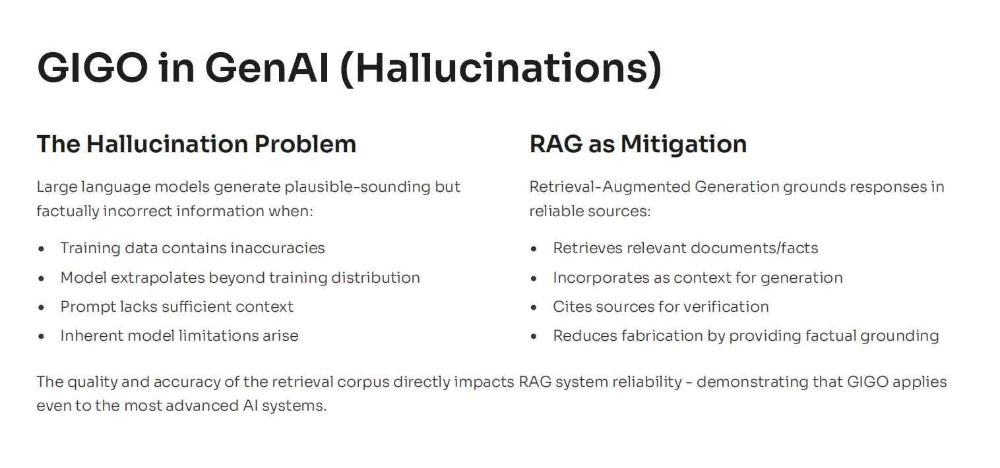

 

---

## Data Migration

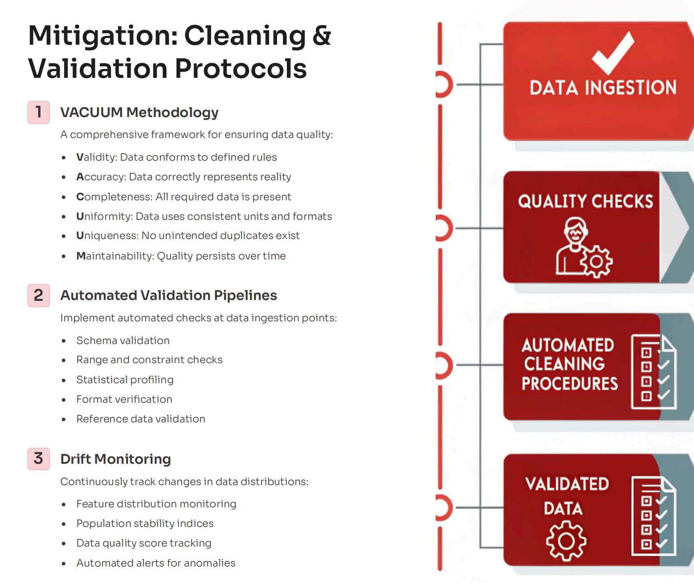

---

## Data Quality Frameworks

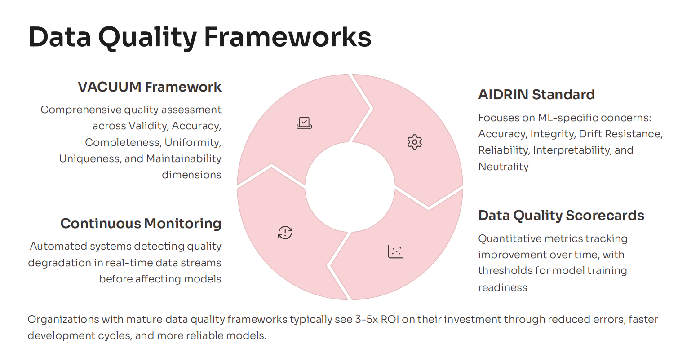

---

## Data Case Studies

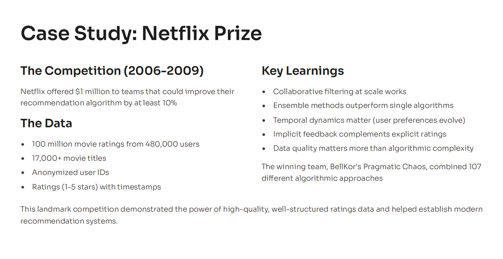
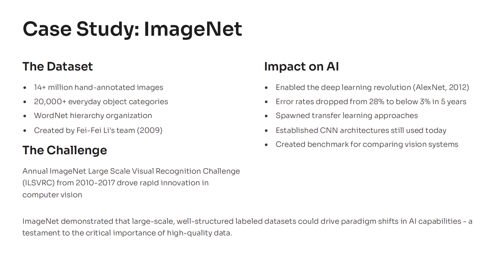

---

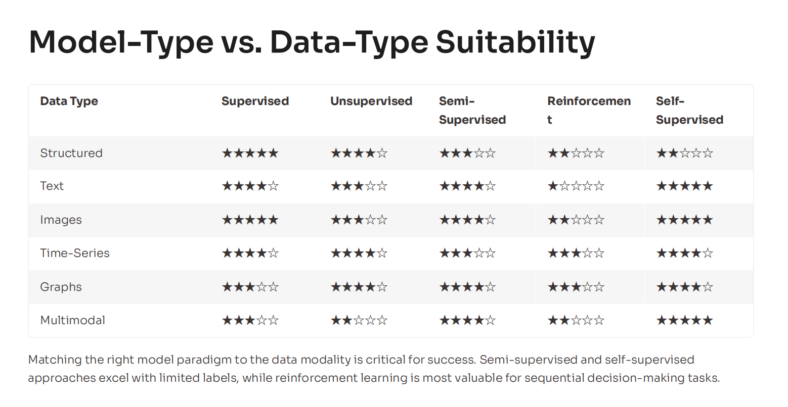
