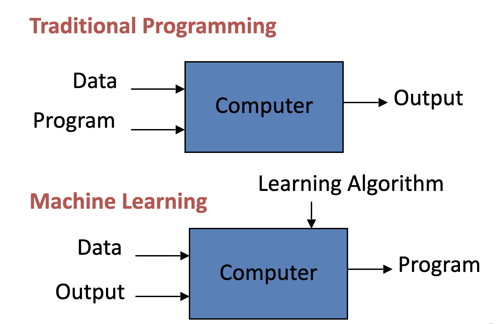
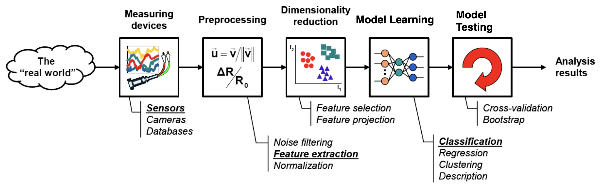
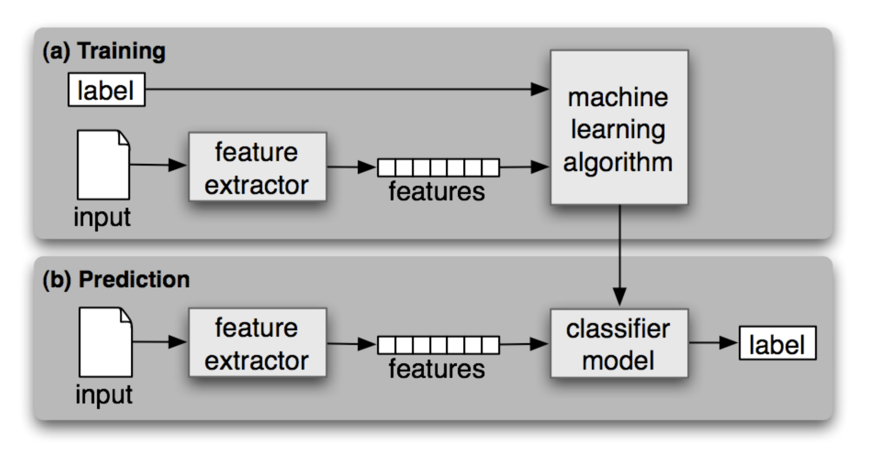
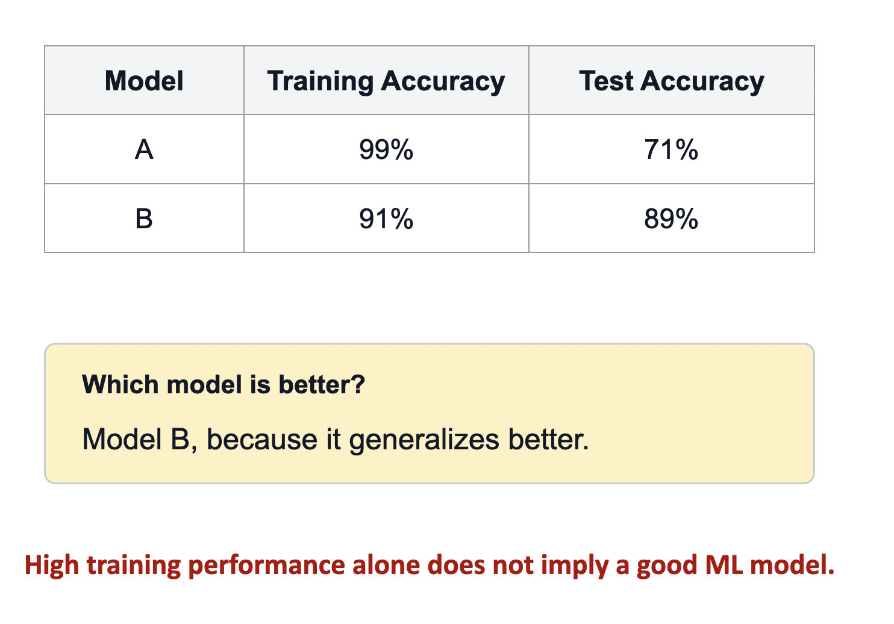

# Introduction to ML

## What is Machine Learning?

`Machine Learning (ML)` is a branch of Artificial Intelligence (AI) `that enables computers to learn patterns from data and make predictions or decisions without being explicitly programmed for every task`

Instead of following fixed rules, machine learning algorithms improve their performance by learning from past data

```pwd
Machine Learning is the science of teaching computers to learn from data and improve their performance over time.
```



<br/>

## How Machine Learning Process





- Collect data
- Clean and preprocess the data
- Select a machine learning algorithm
- Train the model using historical data
- Evaluate the model's performance
- Make predictions on new data
- Continuously improve the model with more data

<br/>

## Pillars of ML

- `Representation` – What is being learned?
- `Evaluation` – How well is it doing?
- `Optimization` – How to improve performance?

<br/>

## Evaluation of a Model

The objective is not to memorize the training data. The objective is to perform well on new examples.



<br/>

## Common Machine Learning Applications

- Recommendation systems (`Netflix`, `YouTube`, `Spotify`)
- Fraud detection
- Image recognition
- Speech recognition
- Chatbots and virtual assistants
- Medical diagnosis
- Stock market prediction
- Predictive maintenance
- Autonomous vehicles

<br/>

## Advantages

- Learns automatically from data
- Improves prediction accuracy
- Handles large datasets efficiently
- Automates repetitive decision-making
- Discovers hidden patterns

<br/>

## Limitations

- Requires large amounts of quality data
- Can be computationally expensive
- May overfit or underfit the data
- Results depend on data quality
- Some models are difficult to interpret

<br/>

## Key Terms

- `Dataset`: Collection of data used for training and testing
- `Feature`: Input variable used for learning
- `Label` (Target): Expected output
- `Model`: The learned representation from data
- `Training`: Learning from data
- `Testing`: Evaluating the trained model on unseen data
- `Prediction`: Output generated by the model for new data
