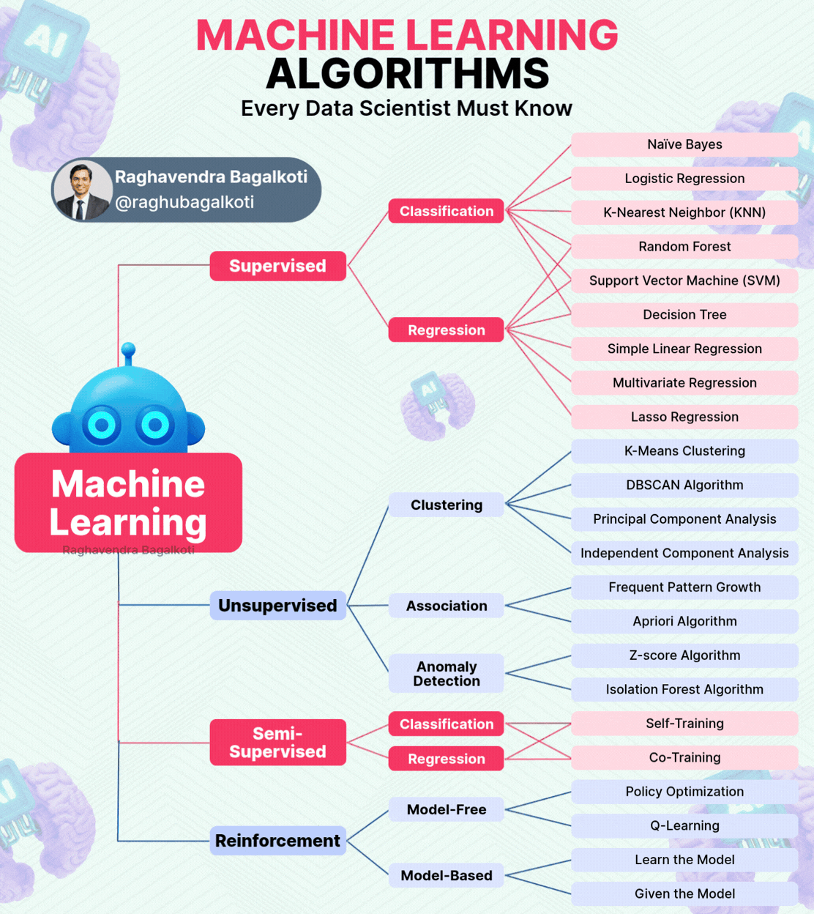
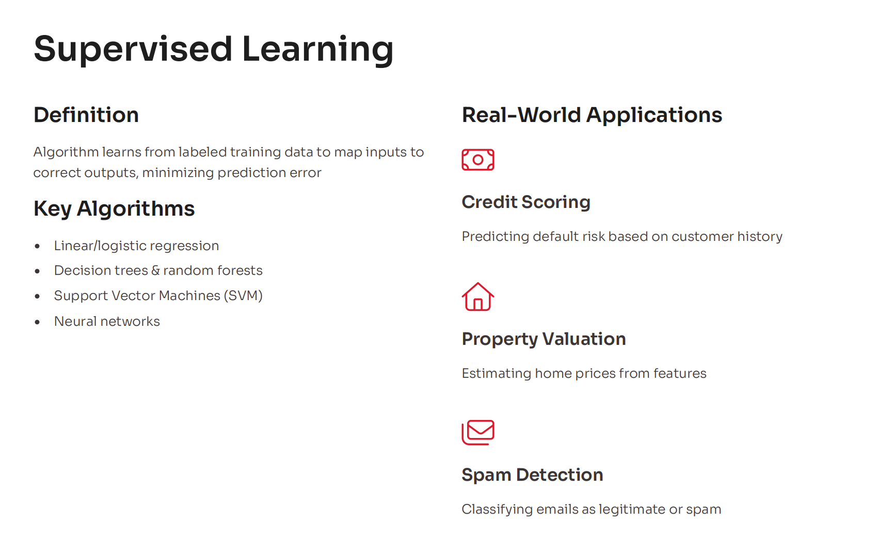
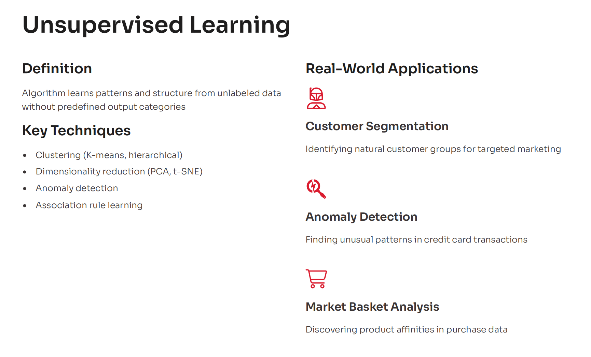
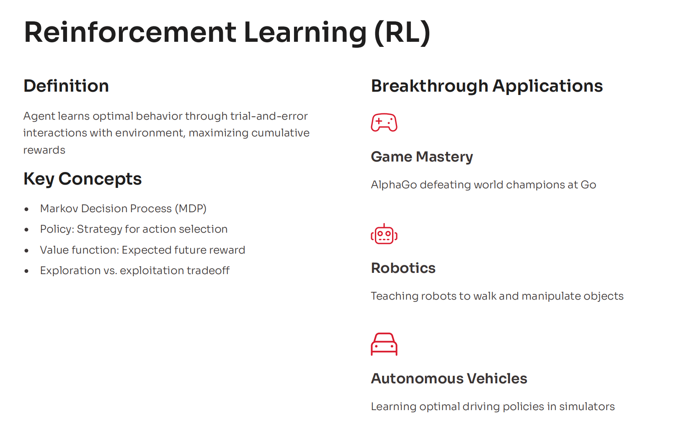
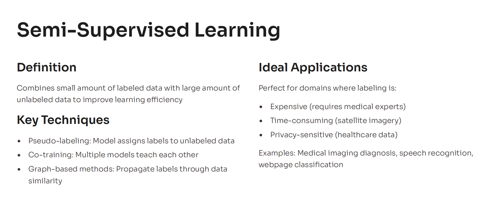
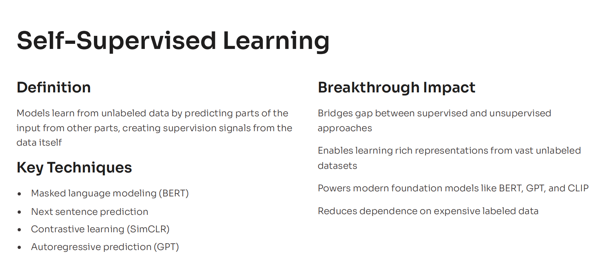

# Types of Machine Learning

---

- [Supervised Learning](./sl.md)

- [Unsupervised Learning](./ul.md)

- [Reinforcement Learning](./rl.md)

---

- [Semi-Supervised Learning](./ssl.md)

- [Self-Supervised Learning](./ssle.md)

---

## Summary

| Learning Type | Input Data | Goal / Primary Task | Core Example |
| :--- | :--- | :--- | :--- |
| **Supervised** | Fully Labeled | Predict target outputs / classes | Email spam filters |
| **Unsupervised** | Unlabeled | Discover hidden patterns & groups | Customer market segmentation |
| **Semi-Supervised** | Mostly Unlabeled + Few Labeled | Improve accuracy cheaply | Facial recognition tagging |
| **Self-Supervised** | Raw Data (Self-Labeled) | Learn foundational context | LLM text generation |
| **Reinforcement** | Environment Interactions | Maximize reward via decisions | Robotics & Autonomous cars |
