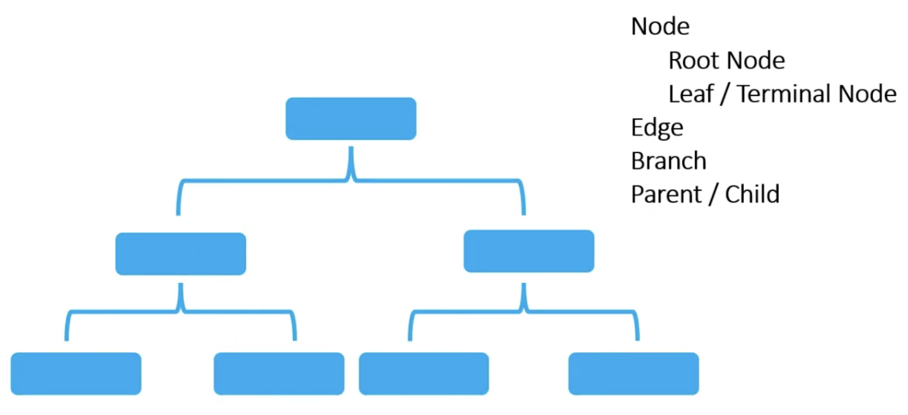
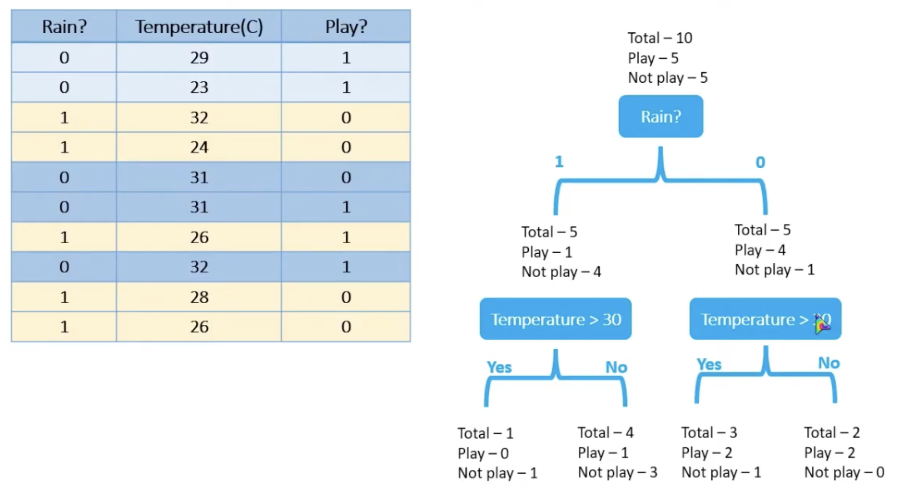
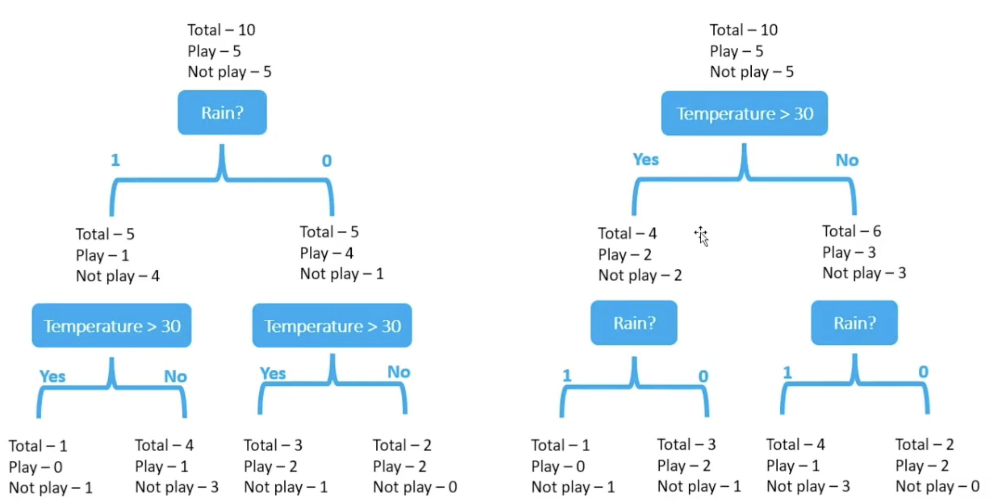
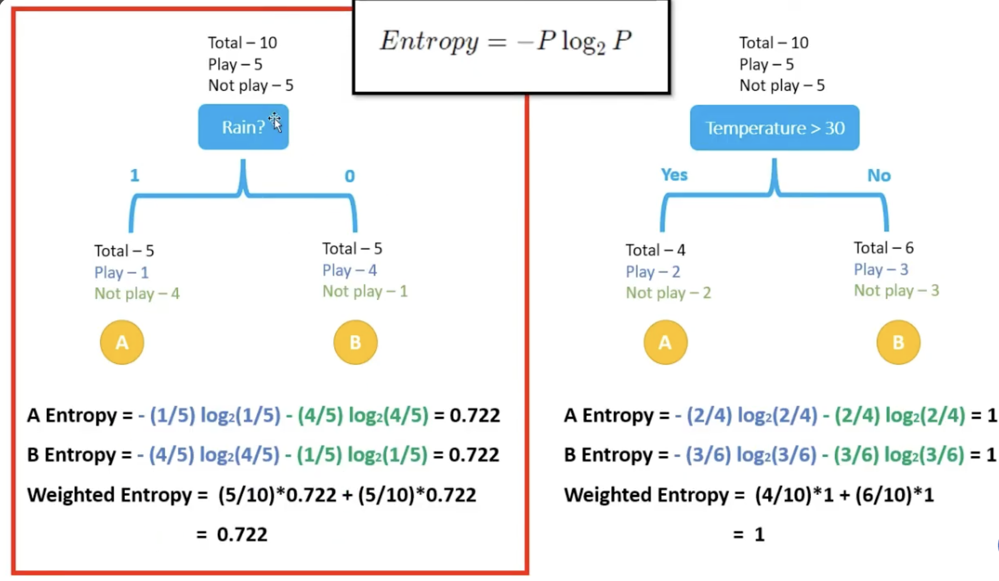

# Decision Tree

`Decision Tree` is a non-parametric supervised machine learning algorithm used for both classification (predicting a category) and regression (predicting a continuous value) tasks

<br/>

## The Core Structure



```pwd
       [ Root Node ]       <- First split / Full dataset
          /     \
      Branch   Branch      <- Outcomes of the decision rule
        /         \
 [Internal]     [ Leaf ]   <- Internal node asks another question
   Node            Node    <- Leaf node gives final prediction
   /    \
Branch  Branch
 /        \
[Leaf]   [Leaf]
```

<br/>

How this is work under the hood in a model? It gets the data set and creates a tree something like this



We can create decision trees according to features like below



For that we can use below things to validate:
    - **Entropy**
    - **Gini Index**
    - **Chi-Square**
    - **Information Gain**

We get the lowest entrophy count as best for a one feature


So if we calculate entrophies for all features we can decide what tree is going to be the best one

<br/>

## Example

[Example](../../python/decision-tree/DT.ipynb)
