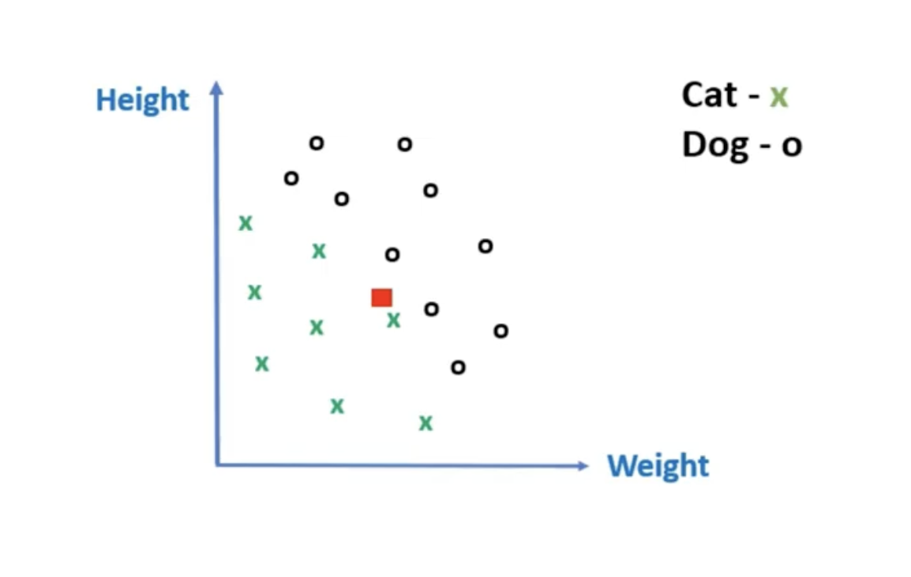
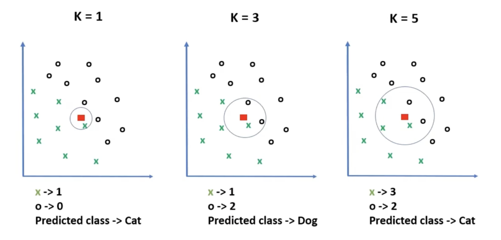
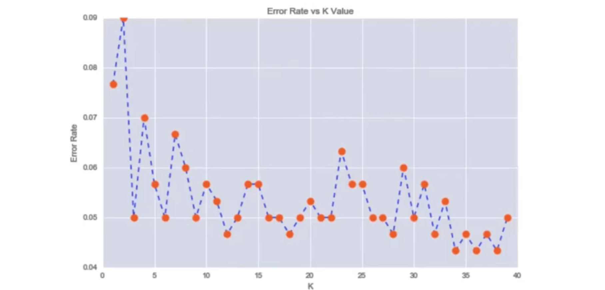
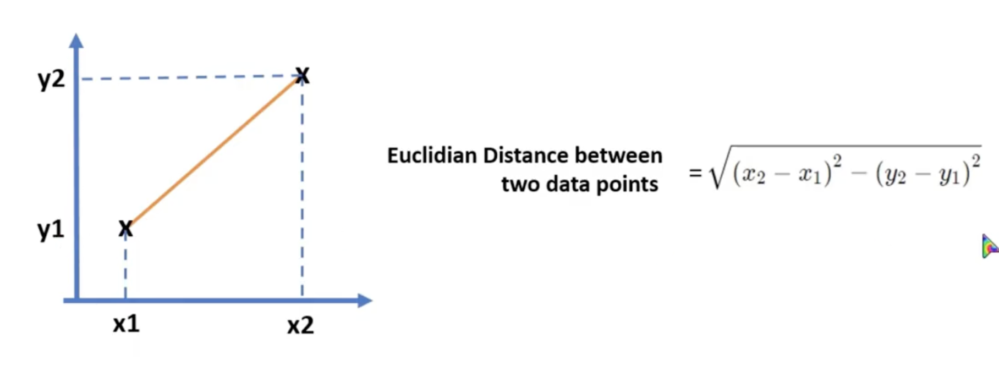

# K-Nearest Neighbours | KNN

A simple and popular machine learning method used to solve sorting and number-guessing problems.

It looks at data points closest to a new piece of data and guesses what it is based on its closest friends.

We need to predict the red dot place value. How? Using KNN

Depend on the `K Value` output can be different. So we need to give the correct `K Value` This values get the nearest data points for requested data point.

We need to be careful about selecting the `K Value` because wrong K Values led us into underfitting and overfitting.

Depend on the `K Value` how it gets the distance to selected data points is, it is using euclidian distance way.

---

## Example

Look at [this](../../python/knn/KNN%20using%20iris%20dataset.ipynb) example about how to train a model using `KNN Method`
