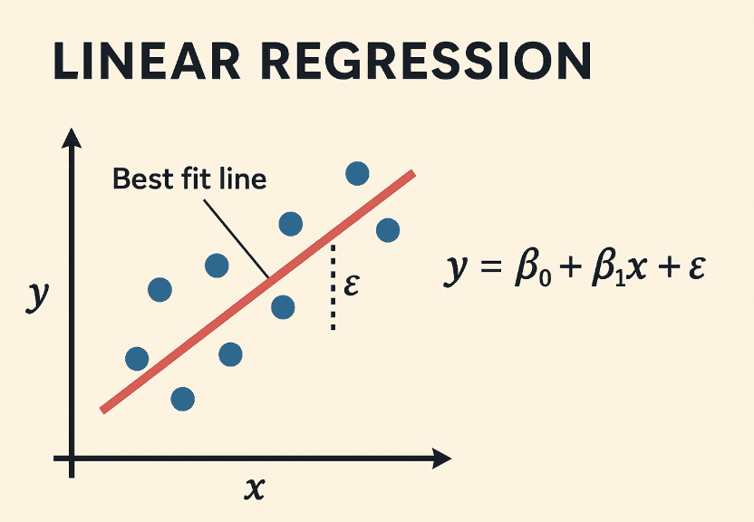
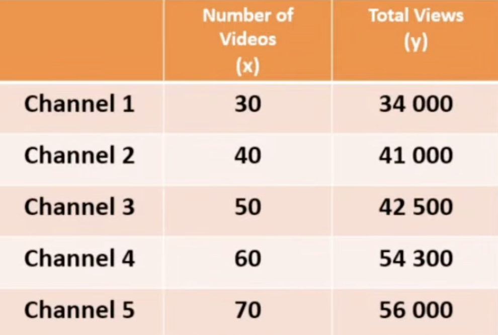
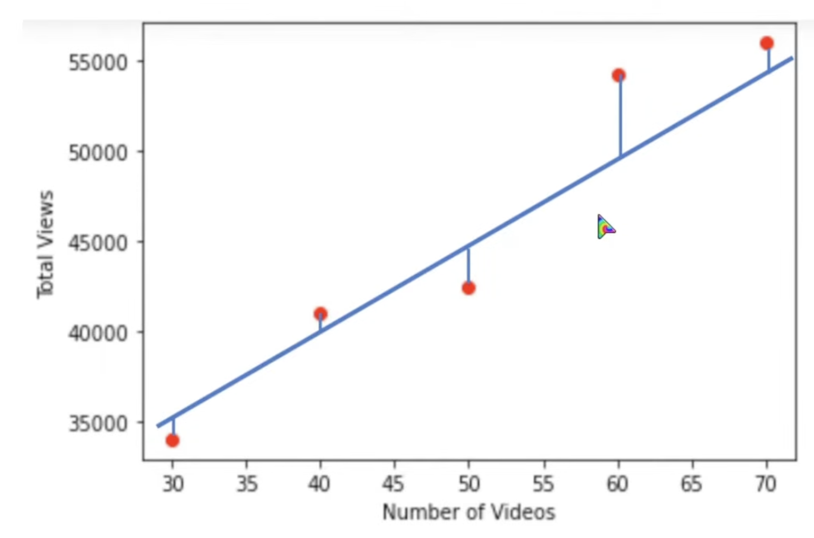
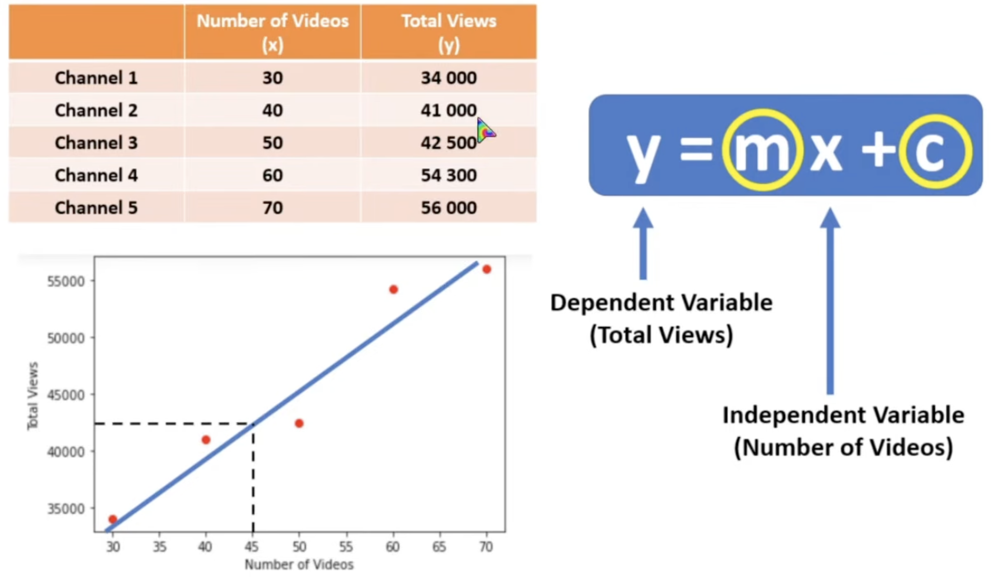
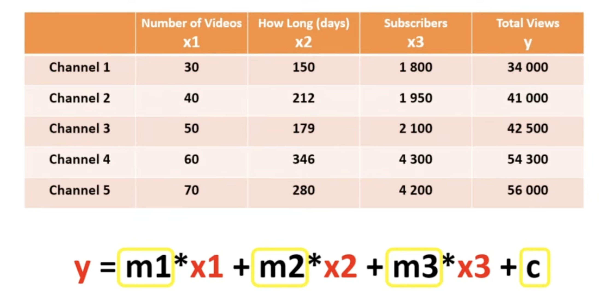
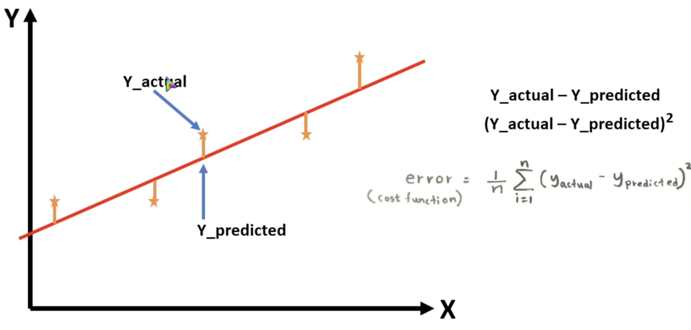
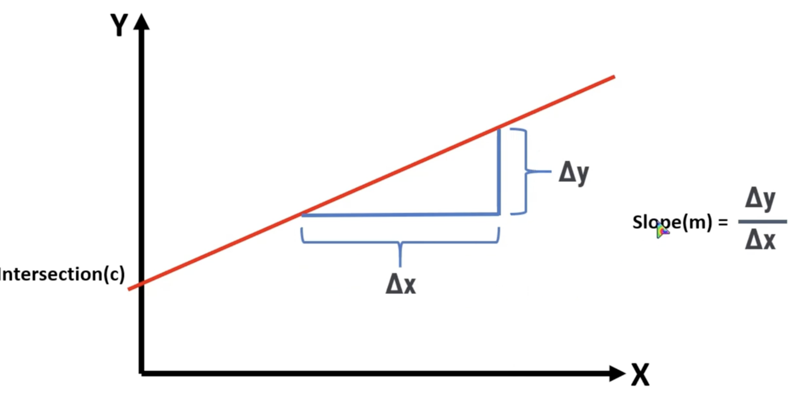
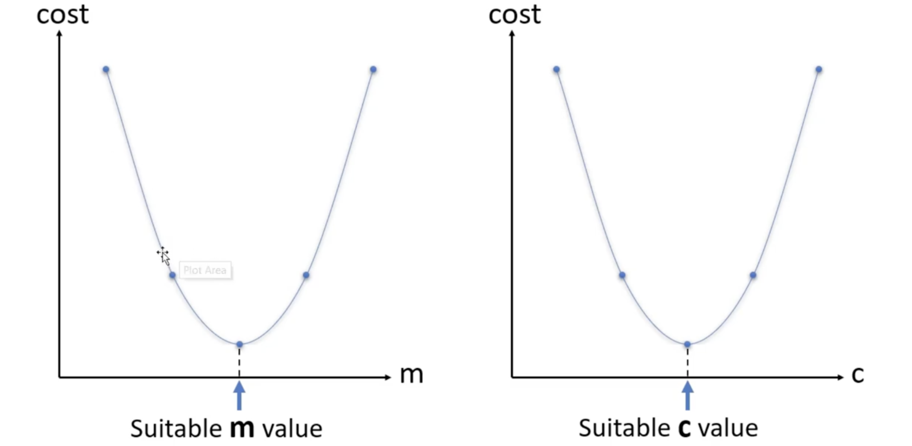

# Linear Regression

`Linear regression` is a basic statistical and machine learning method used to predict a number value based on another variable

It finds a straight line of best fit through data points to show how one variable affects another

---

## How It Works

- Uses an input variable (independent variable) to predict an output target (dependent variable)

- Follows a straight-line math equation: `y = mx + b` (where y is the output, x is the input, m is the slope, and b is the y-intercept)

- Finds the best line by making the total error (distance between the actual data points and the line) as small as possible

---

## Types of Linear Regression

`Simple Linear Regression`: Uses only one input variable to predict the output (like predicting a worker's salary using their years of experience)

[View Simple Linear Regression Example](../../python/linear-regression/Single%20variable.ipynb)

 

`Multiple Linear Regression`: Uses two or more input variables to make a prediction (like predicting a house price using both its size and the number of rooms)

[View Multiple Linear Regression Example](../../python/linear-regression/Multiple%20Variable.ipynb)

---

## How do we get the best fit line?

This is automatically doing by the model internally but,

For that it is using `Cost Function` and `Gradient Decent` for that

 

### Cost Function

The `cost function` measures how wrong your model's predictions are

\(J(m,b)=\frac{1}{n}\sum _{i=1}^{n}(y_{pred}-y_{actual})^{2}\)

 

 

### Gradient Decent

`gradient descent` is the optimization algorithm used to minimize that error by updating the model's weights

\(m=m-\alpha \frac{\partial J}{\partial m}\)

 

---

