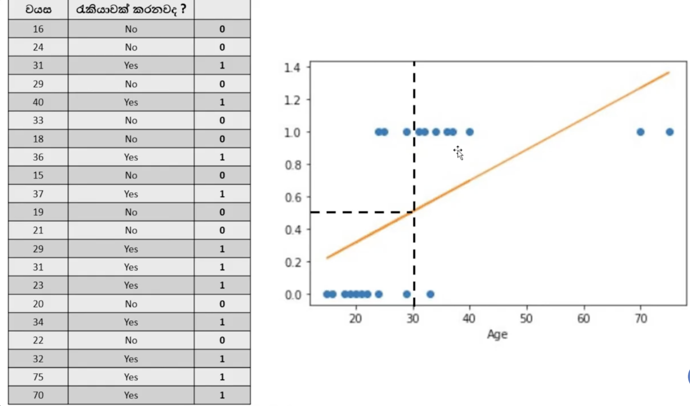
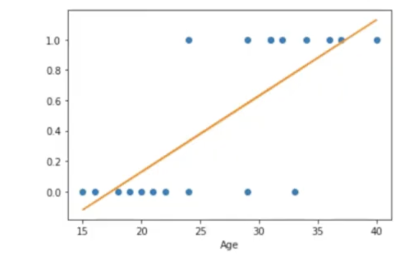
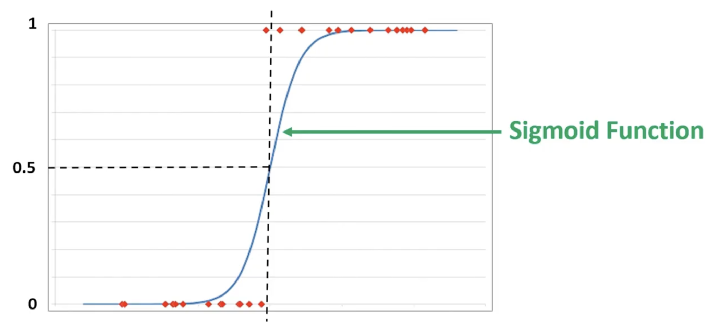
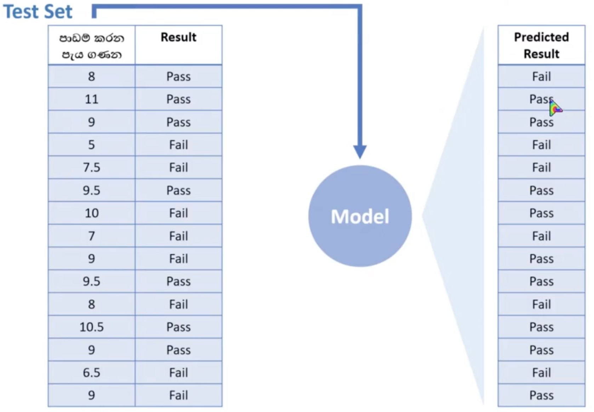
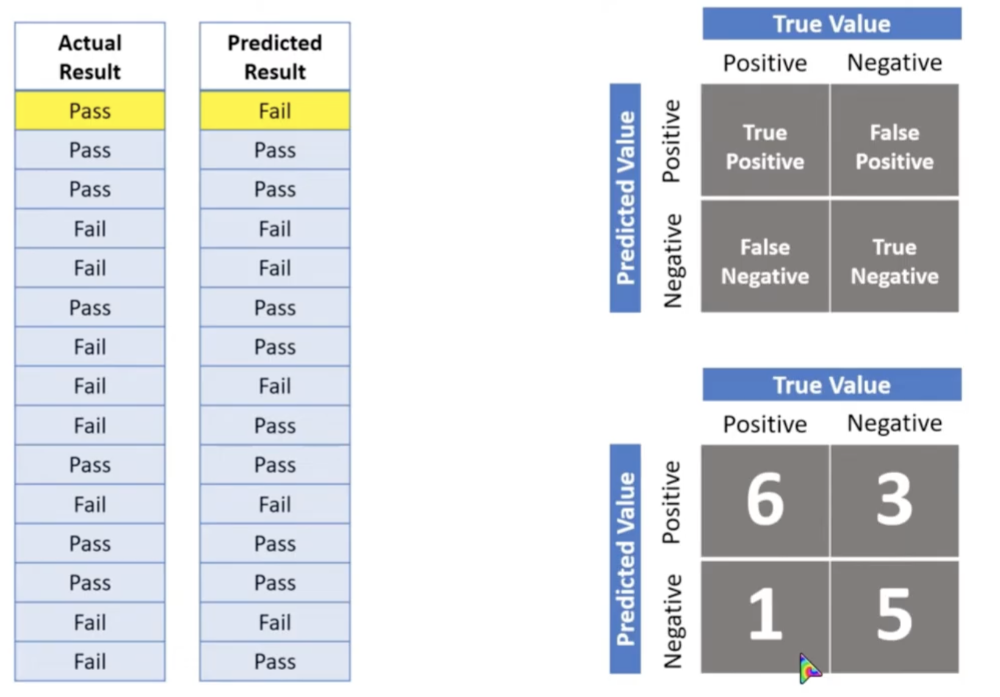
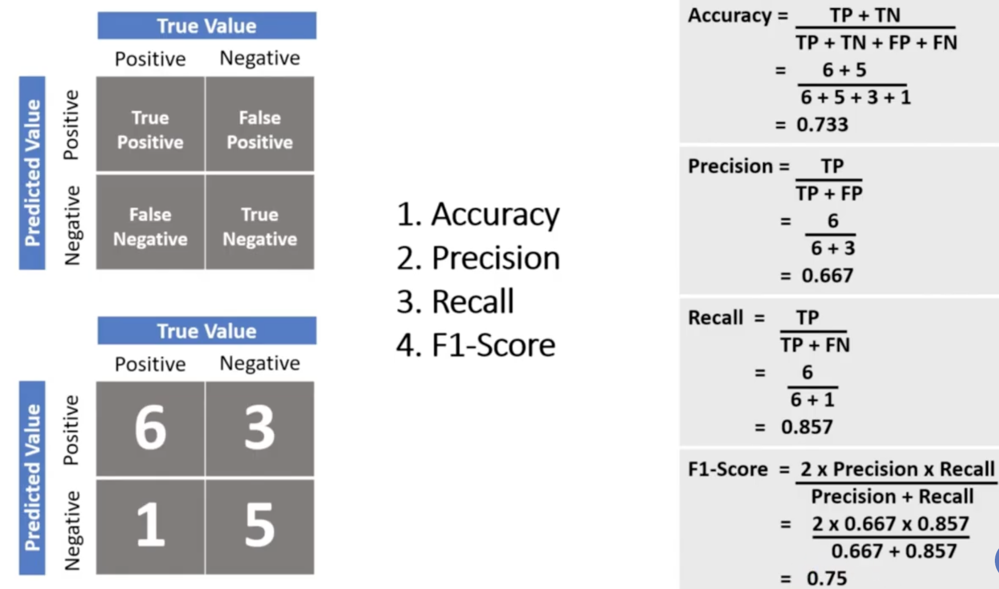

# Logistic Regression

To solve a classification problem

**Classificatioins** are 2 types

- Binary Classification
- Multi Class Classification

 

Can't we solve classification problem using linear regression? `Yes` we can, but when if `X` axis data values getting larger data correctness becomes falsy / wrong / not accuracy. [Like Image]

This is where we have low `X` axis value which is more truth. (But still not good because `X` axis can be larger value and it will not become good accuracy)

But if we can get something like this, we can get better results

 

[View Logistic Regression Example](../../python/logistic-regression/Logistic_Regression.ipynb)

---

## Evaluate Classification Models / Confusion Matrix

`Confusion Matrix` is a table that evaluates a classification model's performance

 

## The Four Outcomes

**True Positive (TP)**: The model predicts positive, and the actual value is positive
**True Negative (TN)**: The model predicts negative, and the actual value is negative
**False Positive (FP)**: The model predicts positive, but the actual value is negative (Type I error)
**False Negative (FN)**: The model predicts negative, but the actual value is positive (Type II error)

 

## Key Metrics Derived from the Matrix

**Accuracy**: (TP + TN) / (TP + TN + FP + FN) — Overall correct predictions
**Precision**: TP / (TP + FP) — Accuracy of positive predictions
**Recall (Sensitivity)**: TP / (TP + FN) — Ability to find all positive instances
**F1-Score**: Harmonic mean of precision and recall

 

  

  

