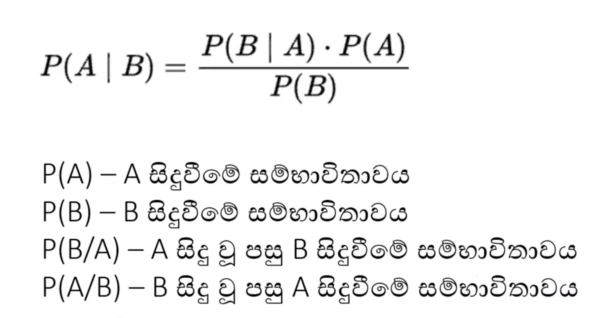
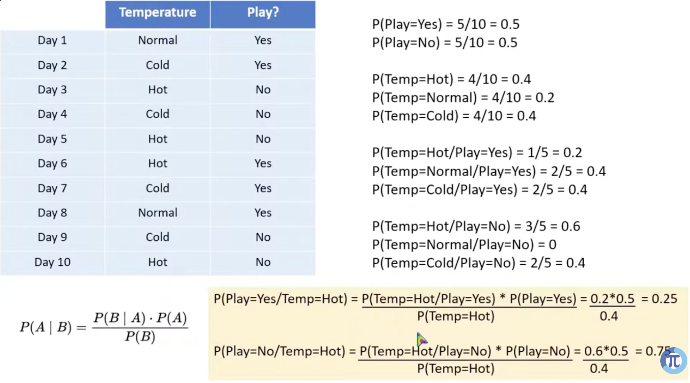
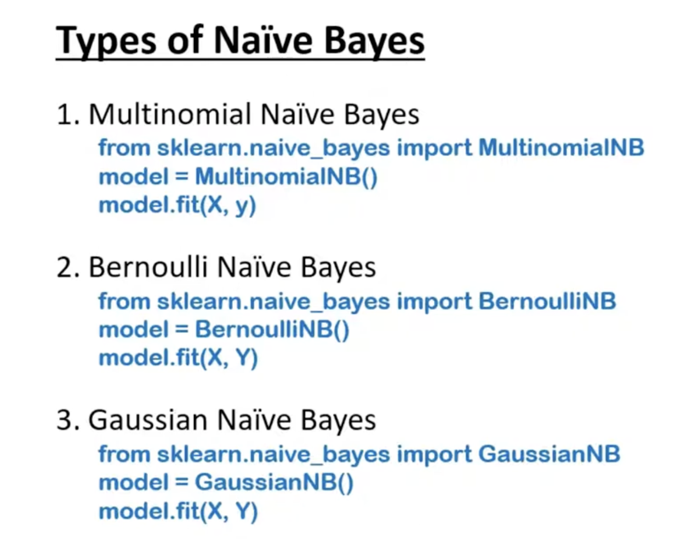
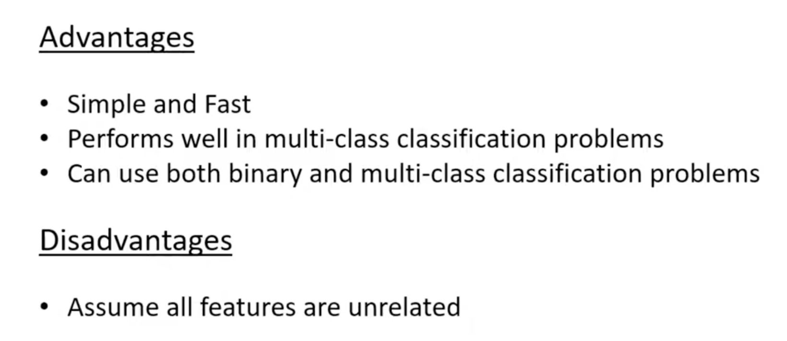
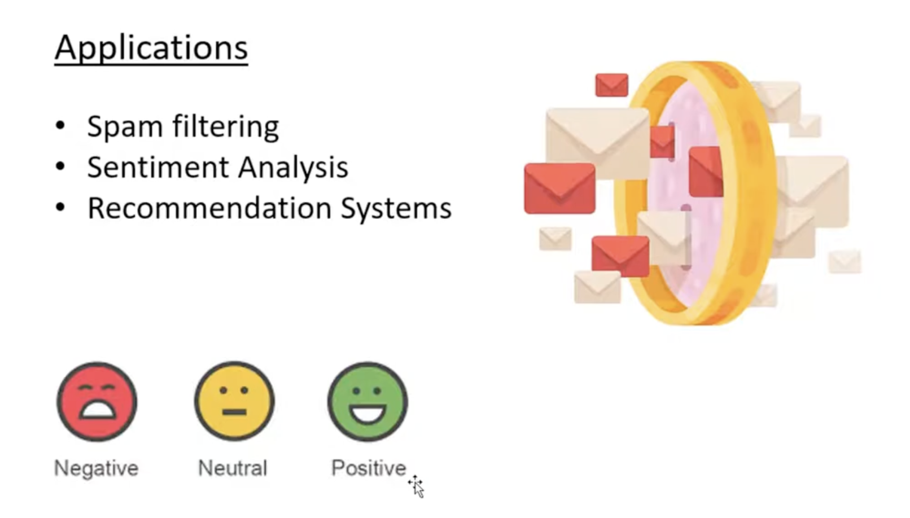

# Naive Bias

The `Naive Bayes` algorithm is a supervised machine learning classification method based on Bayes' Theorem that calculates the probability of a data point belonging to a specific category

 

This is using Bayes Therom under the hood

 

## Pros and Cons

 

## Usages

