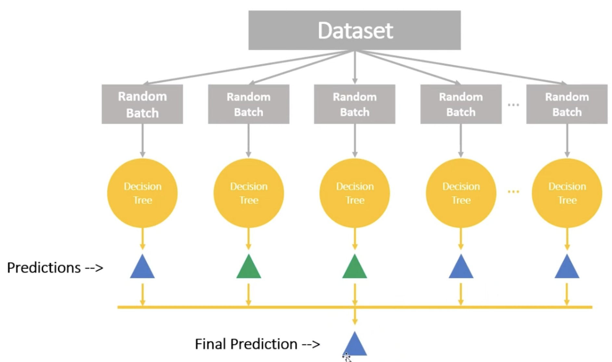
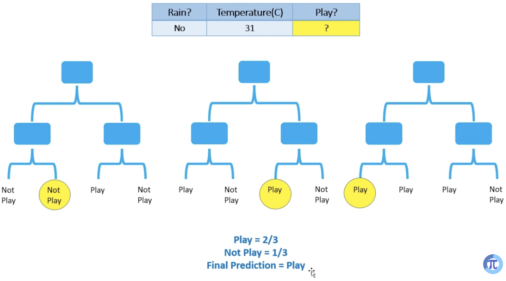
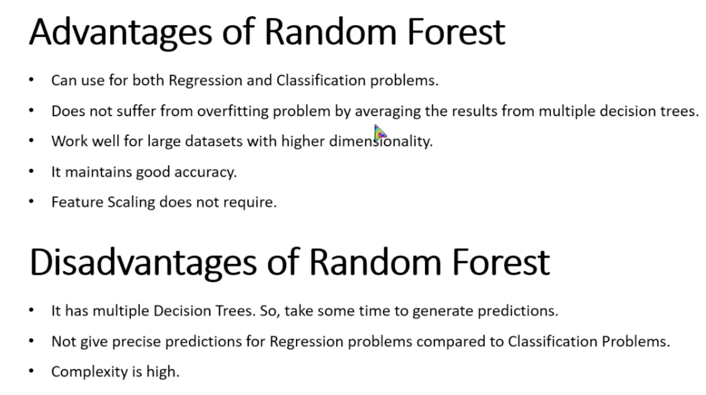

# Random Forest

`Random Forest` is an ensemble machine learning algorithm that combines multiple decision trees to create a single, more accurate, and stable predictive model.

`In here we consider multiple outputs from decision trees and it outputs the highest output value`

 

 

## Pros and Cons

 

## Example

