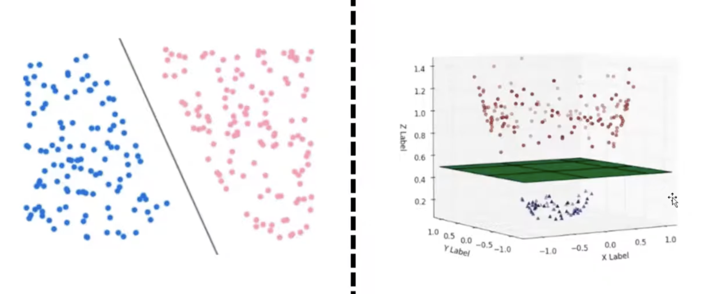
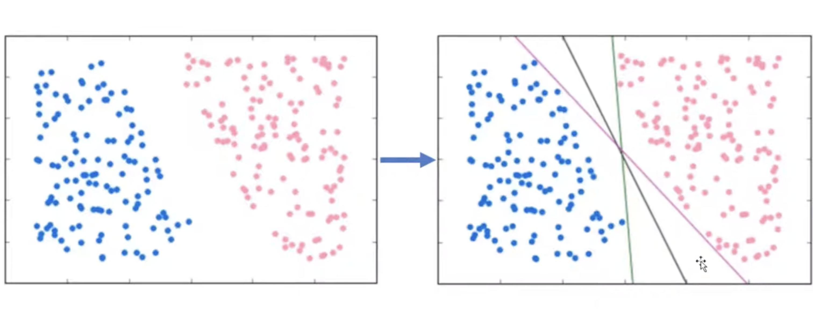
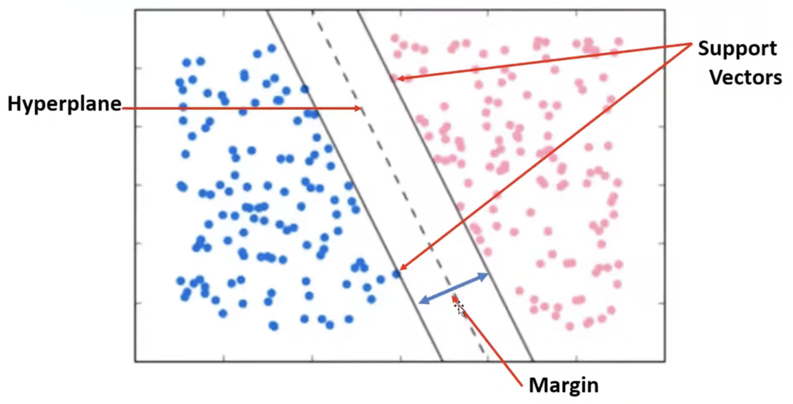
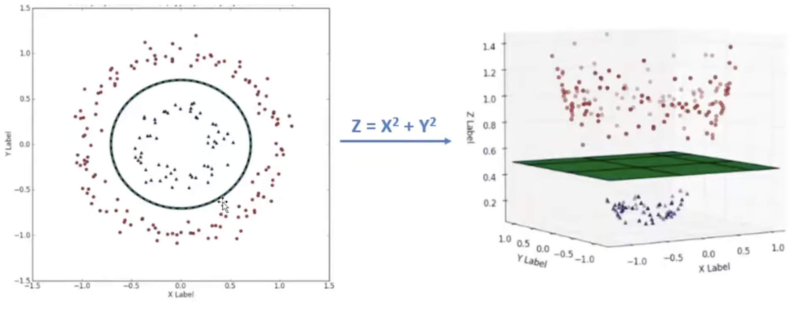
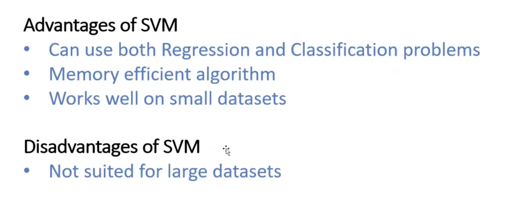

# Support Vector Machine

`A Support Vector Machine (SVM)` is a supervised machine learning algorithm used mostly for classification tasks and sometimes for regression

It works by finding a decision boundary, called a hyperplane, that best splits data points into different groups or classes

 

 

## Pros and Cons

 

## Usage

